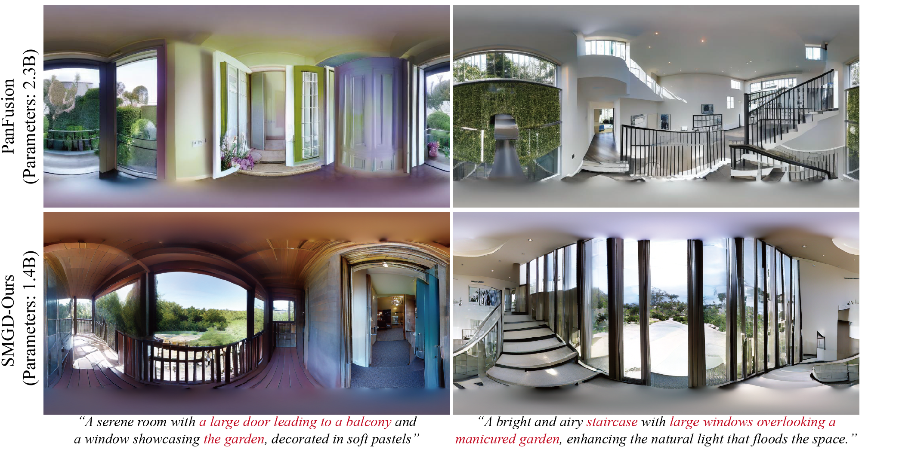
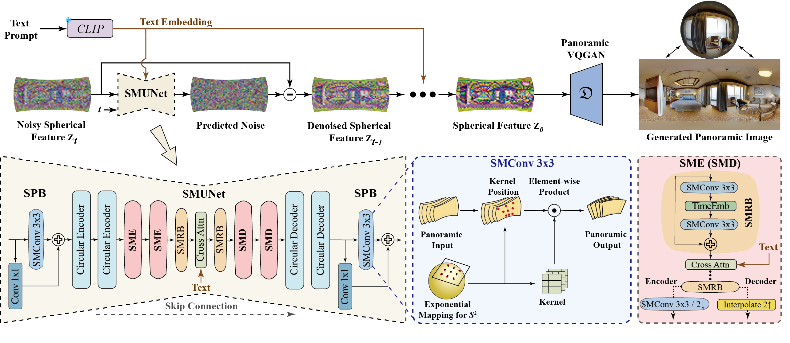

## SMGD: Spherical Manifold Guided Diffusion Model for Panoramic Image Generation

- This is the official repository of the paper "Spherical Manifold Guided Diffusion Model for Panoramic Image Generation" from CVPR2025. 

- [paper](https://openaccess.thecvf.com/content/CVPR2025/papers/Sun_Spherical_Manifold_Guided_Diffusion_Model_for_Panoramic_Image_Generation_CVPR_2025_paper.pdf)




## 1. Environment Set-up
### Install python:
```sh
# Base python environment
conda create -f env.yaml
# Activate environment
conda activate ldm-xformers
```
### 🛠️ Clone this repository and install some extra dependcies:
```sh
# Clone this repository
git clone https://github.com/chronos123/SMGD --recursive
# Install clip
cd src/clip
pip install -e .
# Install taming-transformers
cd src/taming-transformers/
pip install -e .
```
### 🛠️ Install the SMConv dependencies

The SMConv is implemented based on [SphereNet](https://github.com/ChiWeiHsiao/SphereNet-pytorch).

```sh
cd ldm/modules/SphereNet
pip install -e .
```

## 2. Dataset

We use the Matterport3D dataset and *preprocess/preprocessing.py* is used for generating training and testing images.

Matterport3D download: https://niessner.github.io/Matterport/.

The propmts are generated through the Salesforce/blip2-opt-2.7b model and we have saved it in preprocess/Matterport.json.

Change the path in the <config.yaml> (i.e., VQGAN.yaml, SMGD.yaml) file to use your own dataset.

## 3. Pre-trained Weight

Download our pre-trained weight from *[last.ckpt](https://huggingface.co/aberts/SMGD/tree/main)* and put it on *logs/ckpt/last.ckpt*.

```bash
mkdir logs/ckpt
```

## 4. Training


### 🛠️ First, train the VQGAN for image encoding and decoding

```bash
python main_fsdp.py -b configs/VQGAN.yaml -t --gpus 6,7
```

The pretrained VQGAN can be downloaded from *[vqgan.ckpt](https://huggingface.co/aberts/SMGD/tree/main)*.

### 🛠️ Then, put it on "VQ_ckpt/vqgan.ckpt".
```bash
mkdir VQ_ckpt
```

### 🛠️ Lastly, train the SMGD based on the trained VQGAN.

```bash
python main_fsdp.py -b configs/SMGD.yaml -t --no_test --gpus 6,7 --scale_lr False
```

## 5. Inference

### 💓 Generating panoramic images for calculating FID:
- Generating 10K images
```bash
python multi_sample.py --cfg configs/SMGD.yaml --ckpt logs/ckpt/last.ckpt --outdir results/dataset --prompt test_prompts/test_prompts.txt --ddim_steps 50 --scale 2.5 --batch_size_per_gpu 4 --gpus 4,5
```
- Calculating FID
```bash
fidelity --input1 /path/to/dataset --input2 /results/dataset/samples --fid --gpu 0
```

### 💓 Generating panoramic images from given text prompts:
```bash
python multi_sample.py --cfg configs/SMGD.yaml --ckpt logs/ckpt/last.ckpt --outdir results --prompt test_prompts/inference.txt --ddim_steps 50 --scale 2.5 --batch_size_per_gpu 1 --gpus 7 --seed 8894
```


## 6. Contact

If you have any question about our work or code, please email `xianchengsun@buaa.edu.cn`.

## Reference

comming soon

